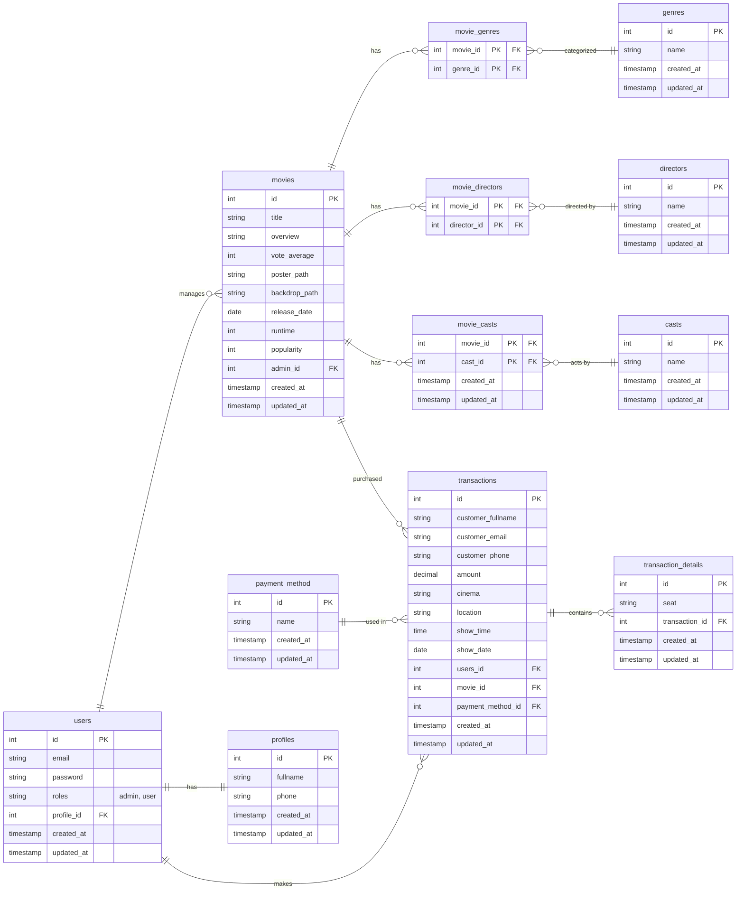

# Backend Cinevo: Movie Ticket Booking App (Node Version)

This project is a re-implementation of the Cinevo movie ticket booking application backend. Previously built with Go and the Gin Gonic framework, this version utilizes a different tech stack: Node.js, Express.js, Sequelize ORM, and PostgreSQL.

**Postman documentation:** [url](https://faisal-9346779.postman.co/workspace/faisal's-Workspace~9a2d1237-407a-4a6e-83f6-740c8b0f0242/collection/46112281-01c08e30-dd09-44cd-b813-25e0a8b4fd88?action=share&creator=46112281)

## API Endpoints Documentation

| Method | Endpoint                  | Description                |
|--------|---------------------------|----------------------------|
| POST   | /admin                    | Add a new movie            |
| DELETE | /admin/{id}               | Delete a movie             |
| PATCH  | /admin/{id}               | Update a movie             |
| POST   | /transactions             | Booking Tickets            |
| GET    | /transactions             | Ticket Result              |
| GET    | /transactions/history     | Transactions History       |
| GET    | /transactions/payments    | Get All payment methods    |
| GET    | /user                     | Get User Profile           |
| PATCH  | /user                     | Update User Profile        |
| POST   | /auth/register            | Register a new user        |
| POST   | /auth/login               | Login a user               |
| POST   | /auth/logout              | Logout user                |
| POST   | /auth/reset-password      | Reset Password             |
| POST   | /auth/forgot-password     | Forgot Password            |
| GET    | /movies                   | Get all movies             |
| GET    | /movies/now-showing       | Get now showing movies     |
| GET    | /movies/upcoming          | Get upcoming movies        |
| GET    | /movies/{id}              | Get movie detail by id     |
| GET    | /movies/genres            | Get all genres             |
| GET    | /movies/casts             | Get all casts              |
| GET    | /movies/directors         | Get all directors          |

## ERD (Entity Relationship Diagram)




## Installation

Follow these steps to set up the Cinevo backend locally:

1. **Clone the Repository**:
   ```bash
   git clone https://github.com/VsalCode/fgo24-express-tickitz.git
   cd fgo24-express-tickitz
   ```

2. **Install Dependencies**:
   ```bash
   npm i
   ```

3. **Set Up Environment Variables**:
   Create a `.env` file in the project root and add the required environment variables (see [Environment Variables](#environment-variables)).

4. **Run the Application**:
   ```bash
   npm run dev
   ```

## Environment Variables

Create a `.env` file in the project root with the following variables:

```env
PGUSER=
PGPASSWORD=
PGDATABASE=
PGHOST= 

JWT_SECRET=

REDIS_HOST=
REDIS_POST=
REDIS_PASSWORD=
REDIS_DB=
```

Ensure these values are correctly configured for your PostgreSQL and Redis instances.

## Dependencies
This project relies on the following Node.js packages:
- Redis: For caching and session management.
- Multer: For handling multipart/form-data, primarily used for file uploads.
- Dotenv: To load environment variables from a .env file.
- ESLint: For linting and ensuring code quality.
- @types/express: TypeScript type definitions for Express.js.
- Sequelize CLI: Command-line interface for Sequelize ORM.
- Bcrypt: For hashing passwords.
- Morgan: HTTP request logger middleware for Node.js.
- Sequelize: ORM for Node.js, supporting PostgreSQL and other databases.
- Express Validator: support request validation

## How To Contribute
Pull requests are welcome! For major changes, please open an issue first to discuss your proposed changes. 

## License
This project is licensed under the [MIT](https://opensource.org/license/mit) License